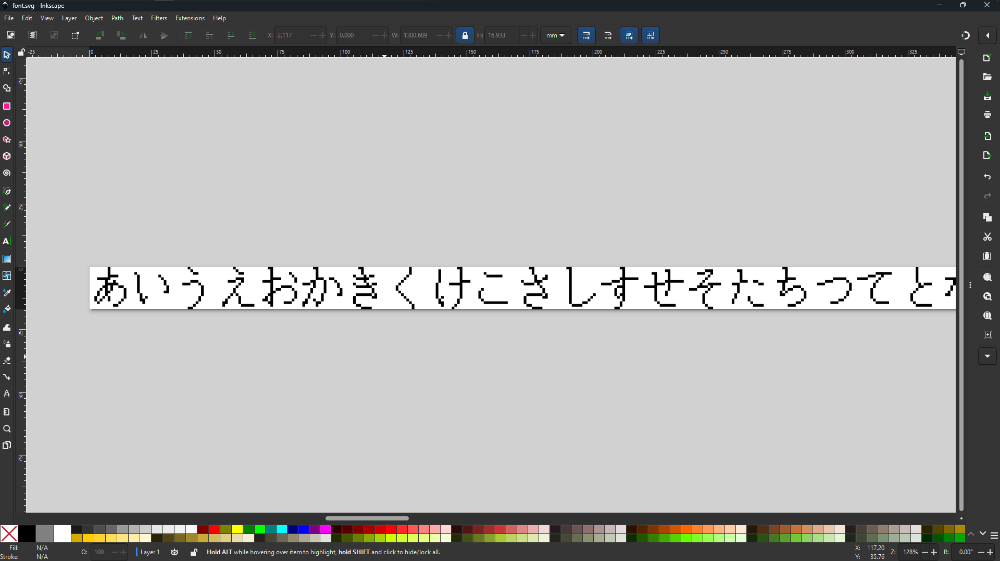
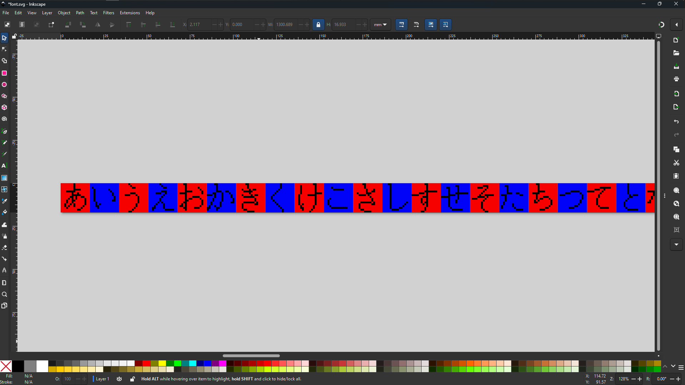

# Font Map to Binary Dot Converter
This is a simple Python utility to convert a graphical font map into a compact, row-major binary font file suitable for embedded devices and low-level graphics.

## Dependencies
- Pillow
- Numpy

> [!NOTE]
> You can also install the dependencies by running `pip install -r requirements.txt`

## Usage
1. Create your single-row font map. Make sure all of the characters in your font map are of the same width and height (monospace). You can do this in Inkscape or any one of your favourite image editors.  

2. Decide how wide your output bitmap should be. In the example, I used a 16x16 dot font so naturally the output width is 16.
3. Run the script! 
> `python [input_file] [char_width] [output_width]`  

## Tips for Creating Font Map
I created my font map ink Inkscape by spreading them out in a long row in a monospace'd fashion. 

The size I chose for each character was 64x64. To ensure that they are actually the right size, I created an array of 64x64 squares in the back to help me line them up. Since the algorithm checks for a threshold, small offsets will be compensated.
